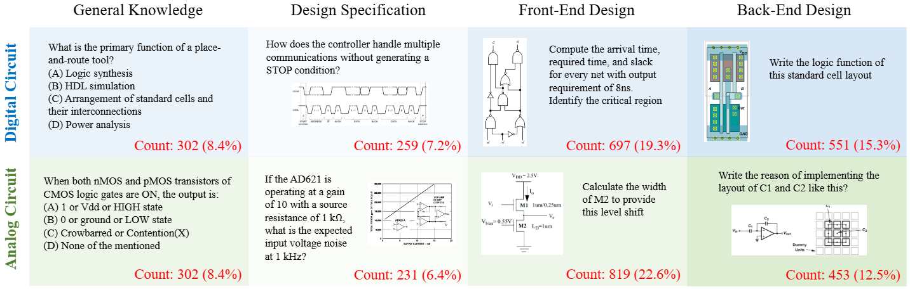

# MMCircuitEval: A Comprehensive Multimodal Circuit-Focused Benchmark for Evaluating LLMs

[Paper](https://arxiv.org/abs/2507.19525)&nbsp;|&nbsp;[HuggingFace](https://huggingface.co/datasets/charlie314159/MMCircuitEval)

> The emergence of multimodal large language models (MLLMs) presents promising opportunities for automation and enhancement in Electronic Design Automation (EDA). However, comprehensively evaluating these models in circuit design remains challenging due to the narrow scope of existing benchmarks. To bridge this gap, we introduce MMCircuitEval, the first multimodal benchmark specifically designed to assess MLLM performance comprehensively across diverse EDA tasks. MMCircuitEval comprises 3614 meticulously curated question-answer (QA) pairs spanning digital and analog circuits across critical EDA stages—ranging from general knowledge and specifications to front-end and back-end design. Derived from textbooks, technical question banks, datasheets, and real-world documentation, each QA pair undergoes rigorous expert review for accuracy and relevance. Our benchmark uniquely categorizes questions by design stage, circuit type, tested abilities (knowledge, comprehension, reasoning, computation), and difficulty level, enabling detailed analysis of model capabilities and limitations. Extensive evaluations reveal significant performance gaps among existing LLMs, particularly in back-end design and complex computations, highlighting the critical need for targeted training datasets and modeling approaches. MMCircuitEval provides a foundational resource for advancing MLLMs in EDA, facilitating their integration into real-world circuit design workflows.

### Overview



MMCircuitEval is a comprehensive benchmark designed to evaluate the performance of Multimodal Large Language Models (MLLMs) in the field of Electronic Design Automation (EDA). It consists of 3614 carefully curated question-answer (QA) pairs that cover a wide range of topics related to digital and analog circuits across various stages of EDA.
- 3614 curated circuit-focused QA problems
- Multi-modality support
- Covering various stages of EDA, including general knowledge, specification, frontend design, and backend design
- Multiple circuit types, including digital and analog circuits
- Multiple abilities tested, including knowledge, comprehension, reasoning, and computation
- Multiple question types, including single-answer choice, multi-answer choice, fill-in-the-blank, and open-ended
- Multiple difficulty levels, including easy, medium, and hard questions

### Data Usage

The MMCircuitEval dataset can be downloaded from HuggingFace:
```python
from datasets import load_dataset
# load the full dataset
dataset = load_dataset('charlie314159/MMCircuitEval')
# load the dataset corresponding to a specific EDA stage
# valid splits: 'general', 'spec', 'frontend', 'backend'
# dataset = datasets.load_dataset('charlie314159/MMCircuitEval', split='general')

# get a problem in the dataset
problem = dataset['general'][0]
print(problem.keys())
# >>> dict_keys(['statement', 'ic_type', 'source', 'extra', 'questions', 'question_types', 'images', 'answers', 'explanations', 'difficulties', 'abilities'])
# there can be multiple sub-questions in a problem. They share a statement
print(problem['statement'])
# >>> ''
print(problem['questions'])
# >>> ['-6dB is equivalent to __________ power gain. A 0.5 B 0.25 C 0.75 D 0.8']
print(problem['answers'])
# >>> ['B']
```

Basic question augmentation techniques are provided in [`data_processing/scripts/`](./data_processing/scripts/):
- Basic question augmentation through paraphrasing: [`augment_questions.py`](./data_processing/scripts/augment_questions.py)
- New question proposal: [`propose_questions.py`](./data_processing/scripts/propose_questions.py)
- Question tagging and metadata generation: [`tag_questions.py`](./data_processing/scripts/tag_questions.py)

### Benchmark Usage

After specifying the tested model in [`evaluation/models/`](./evaluation/models/), the benchmark can be run through the script [`run_benchmark.py`](./evaluation/scripts/run_benchmark.py):
```bash
cd evaluation
python scripts/run_benchmark.py <field>
```
in which `<field>` can be `general`, `spec`, `frontend`, or `backend`.

### BibTeX

```
@article{zhao2024mmcircuiteval,
  title={MMCircuitEval: A Comprehensive Multimodal Circuit-Focused Benchmark for Evaluating LLMs},
  author={Zhao, Chenchen and Shi, Zhengyuan and Wen, Xiangyu and Liu, Chengjie and Liu, Yi and Zhou, Yunhao and Zhao, Yuxiang and Feng, Hefei and Zhu, Yinan and Wan, Gwok-Waa and others},
  journal={arXiv preprint arXiv:2406.148157},
  year={2024}
}
```